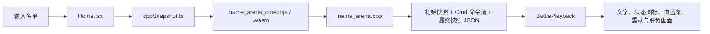

# Name Arena 更新与发布手册

> **适用范围：**本手册面向 Name Arena 的后续维护者。它说明如何安全更新 C++ 战斗核心、前端播放器、状态图标、文字/屏幕动画、WebAssembly 产物，以及如何把已验证的源码镜像同步到 GitHub。若需要逐函数查阅 `cpp/name_arena.cpp`，请同时阅读根目录的 [`name_arena_maintenance_guide.md`](./name_arena_maintenance_guide.md)。

## 1. 先理解项目：谁负责什么

Name Arena 不是“浏览器边打一边算”的游戏。浏览器把名单交给 C++/WASM 后，**整场战斗会先在 C++ 内完全结算**。C++ 返回初始快照、最终快照和有顺序的 `commands` 命令流；React 只负责按顺序显示文字、状态、生命/魔力条和特效。因此，伤害、目标、概率、行动条、死亡、眷属递归死亡和胜负判定都只能由 C++ 决定。



| 层级 | 主文件 | 应放置的内容 | 不应放置的内容 |
|---|---|---|---|
| 战斗权威 | `cpp/name_arena.cpp` | 属性、技能、概率、伤害、状态、死亡、召唤、Cmd | React 状态、CSS、浏览器计时器 |
| WASM 构建 | `cpp/build_wasm.sh` | Emscripten 编译参数和导出函数 | 业务数值或战斗逻辑 |
| 协议边界 | `client/src/lib/cppSnapshot.ts` | JSON TypeScript 类型、WASM 调用、加载器 | 再次计算战斗结果 |
| 播放器 | `client/src/pages/Home.tsx` | Cmd 分行、播放节奏、动态单位、血蓝条与特效触发 | 伤害公式、随机目标、状态层数推导 |
| 视觉 | `client/src/index.css` | 颜色、图标尺寸、状态排版、关键帧动画 | 数值与胜负判定 |
| 回归 | `client/src/pages/Home.playback.test.tsx` | JSON/Cmd 播放、文字、状态、动画类、生命更新 | 随机 C++ 数值的长期固定快照 |

## 2. 第一次在新电脑上运行

项目使用 Node.js、pnpm、Emscripten 和 C++17。不要直接复制旧的 `node_modules`；它很大、平台相关，而且可由锁文件重新安装。请从源码和锁文件恢复依赖。

```bash
# 1) 获取 GitHub 镜像（仓库地址按实际替换）
gh repo clone alpharchmage/alpharchmage.github.io name-arena
cd name-arena

# 2) 安装与锁文件完全一致的 JavaScript 依赖
corepack enable
pnpm install --frozen-lockfile

# 3) 确认 Emscripten 可用；没有时按 Emscripten 官方安装方法配置 emsdk
em++ --version

# 4) 从 C++ 重建浏览器实际加载的 WASM
bash cpp/build_wasm.sh

# 5) 启动开发服务器
pnpm dev
```

浏览器会加载 `client/src/wasm/name_arena_core.mjs` 及其同目录的 `.wasm` 文件。两者都是构建产物，但对当前源码包和 GitHub 镜像而言都应保留：这样即使暂时没有 Emscripten，也能运行已有版本；有 Emscripten 时仍应每次修改 C++ 后重新生成。

## 3. 每次修改的标准流程

维护时不要同时改很多层。先写清“战斗发生什么”，再改 C++，然后补协议、播放器、样式和测试。一次提交最好只包含一个可说明的机制，例如“新增冰霜易伤”“将 K-2 额外烧伤改为消耗一层”。

| 步骤 | 你要做的事 | 完成标准 |
|---:|---|---|
| 1 | 在 `todo.md` 添加一个未完成事项 | 写清规则、视觉与验证条件 |
| 2 | 阅读相近机制 | 先找当前技能/状态/动画，而不是从零复制代码 |
| 3 | 只在 C++ 定义真实规则 | 不在 React 中修改 HP、状态、目标或胜者 |
| 4 | 扩展 C++→TS 协议 | 新字段同时进入 `Player`、`Cmd`、JSON 和 TS 类型 |
| 5 | 扩展前端显示 | 对应 Cmd 能更新单位、日志或特效 |
| 6 | 编写/更新回归夹具 | 用 Cmd 验证最终文本、层数、生命与 CSS 类 |
| 7 | 构建与全量验证 | 四条命令全部成功，且 `git diff --check` 无空白错误 |
| 8 | 将 `todo.md` 标为完成 | 只在验证成功后勾选 |
| 9 | 保存可回退的版本并镜像 GitHub | 不把未验证工作作为发布版本 |

推荐的一次性验证命令如下。它应从项目根目录执行：

```bash
bash cpp/build_wasm.sh && pnpm test && pnpm check && pnpm build && git diff --check
```

| 命令 | 失败通常意味着什么 | 首先检查哪里 |
|---|---|---|
| `bash cpp/build_wasm.sh` | C++ 语法、函数声明、Emscripten 导出或链接问题 | `cpp/name_arena.cpp`、`cpp/build_wasm.sh` |
| `pnpm test` | Cmd 文本、状态快照、动画类或计时行为改变 | `Home.playback.test.tsx` 与 `Home.tsx` |
| `pnpm check` | JSON 类型、可选字段、React/TS 代码不一致 | `cppSnapshot.ts`、`Home.tsx` |
| `pnpm build` | Vite 资源导入、CSS、WASM 路径或生产打包问题 | `.mjs/.wasm`、`cppSnapshot.ts`、CSS |
| `git diff --check` | 尾随空格、补丁格式问题 | 显示的文件和行号 |

## 4. 如何维护 `cpp/name_arena.cpp`

### 4.1 文件的五个区域

虽然战斗核心是单文件，但可以按职责阅读，而不要按 3,000 多行顺序死记。

| 区域 | 典型符号 | 维护原则 |
|---|---|---|
| 结构与全局状态 | `Player`、`Cmd`、`p`、`e`、`seed` | 新状态或新动态单位的最底层数据必须先在此落位 |
| 创建与属性 | `make_player`、`get_atk`、`get_def`、`get_spd` | 所有“实际属性”应走 `get_*`，不能绕过强化/削弱 |
| 伤害和死亡 | `receive_damage`、`take_hit`、`report_death` | 不能自己写 `p[it].hp -= d` 来替代统一管线 |
| 技能与状态 | `basic_attack`、`fireball`、`end_turn`、召唤/阶段函数 | 技能函数只做本技能独有的判定和 Cmd 组织 |
| 调度、JSON 与导出 | `use_skill`、`fight`、`player_json`、`simulate` | 任何新协议字段都要穿过 JSON，最后被前端类型接收 |

`#define int long long` 使文件内的 `int` 实际为 64 位有符号整数。数组和单位座位使用 **1-index**：`p[1]` 是第一名单位；`0` 通常表示无来源、无目标或未找到。不要把座位 `no` 和队伍 `id` 混用。

### 4.2 选择正确的伤害入口

| 伤害类别 | 正确入口 | 为什么 |
|---|---|---|
| 普攻、戳刺、会心、可招架物理技能 | `take_hit(x, it, d, ...)` | 自动处理招架、守护分摊、死亡、反击、吞噬 |
| 一般魔法伤害 | `magic_damage(x, it, ratio)` 后再 `take_hit` | 自动纳入魔攻、魔防、波动和幻魔易损 |
| 烧伤、中毒等 DOT | `receive_damage(it, d, HURT_*)`，再分支 `report_death`/`finish_hurt` | DOT 不应错误触发招架或守护 |
| 生命之轮、直接换血 | 显式更新两边，再发两条同步 Cmd | 这是资源交换，不是攻击 |
| `world.execute(me);` | `receive_damage(..., HURT_LIFE_WHEEL)` | 结束技按规则绕开普通受击/反击链，并由 `world_execute_finished` 锁定主循环 |

下面是一个推荐的“新单目标物理技能”骨架。`d` 是已经完成倍率、防御和波动后的伤害；不要让前端自行计算它。

```cpp
void heavy_strike(int x)
{
    int it = get_target(x);
    if(it == 0) return;

    int d = max(1LL, get_atk(x) * 180 / 100 - get_def(it));
    d = max(1LL, d * (800 + rnd() % 401) / 1000);
    add(p[x].no, p[it].no, 40, 0, p[it].hp, 0,
        "heavy_strike", p[x].name + "重击，", false);
    take_hit(x, it, d, 40, "heavy_strike", "heavy_strike_damage");
    clear_parry_action();
}
```

接着将函数放入 `make_player` 的技能槽，判断是否属于法术（`spell`）和消耗（`cost`），并让 `pickable_special`/`special_weight` 决定何时可用和权重。新增了 `sid=40` 时，应同步维护源码中 `Cmd` 的技能编号注释，避免日后编号冲突。

### 4.3 新增或修改 Buff/Debuff 的完整清单

一个可显示、可叠加、会到期的状态不是只加两个整数。下面的十个位置缺一不可。

1. 在 `Player` 添加 `new_state_int`（强度）和 `new_state_time`（层数/持续时间）。
2. 在 `Cmd` 添加同样的快照字段。
3. 在 `add(...)` 内将目标 `p[b]` 的新字段复制到 Cmd。
4. 在 `cmds_json()` 中输出命令字段；若初始/终局单位也需要展示，在 `player_json()` 中输出。
5. 规定叠加语义：是 `+=` 强度和层数、只刷新层数，还是覆盖；把这条规则写在技能注释中。
6. 规定时机：自身回合开始放 `begin_turn`，回合末 DOT 放 `end_turn`，受击触发放统一伤害管线。
7. 到期时清空**强度和层数**，避免显示为 `8/0` 的残留状态；除非需求明确，否则不输出解除文本。
8. 在 `CppPlayerSnapshot` 和 `CppRenderCommand` 添加可选字段。
9. 在 `Home.tsx` 的状态快照合并和 `statusDefinitions` 中添加显示规则。
10. 在 `Home.playback.test.tsx` 创建“施加 → 叠加 → 到期/清除”的 Cmd 夹具，断言图标标题、层数和最终移除。

> **快照顺序是最重要的规则：**先改 C++ 状态，再调用 `add`。`add` 会把当时状态冻结进 Cmd；如果先写 Cmd 后加层，React 必然显示旧层数。

### 4.4 当前 Boss 机制的特殊维护点

| 机制 | 不能破坏的约束 |
|---|---|
| `mili@!` | 输入标记用于识别 Boss，但初始快照、动态 Cmd 与最终快照都显示为 `mili` |
| 双岛牛奶 | 生命高于 50% 时不选择；第 5 瓶及以后会清除眷属、触发结束技 |
| 月之子 / K-2 / 魔女 | 月之子、K-2 同时至多一名；魔女每局只能成功召唤一次；魔女死亡时递归移除后代 |
| K-2 额外烧伤 | 对敌方现有烧伤造成一次伤害后也消耗一层；强度与层数归零时都要清除 |
| `world.search(you);` | 单目标 250% 物攻，C++ 使用真实物理公式；前端只负责柔和彩色字体 |
| `world.execute(me);` | 每个目标伤害前独立输出字面 `execute`，按该轮最低生命造成绝对伤害；直到仅一人存活，随后 `world_execute_finished` 阻止一切后续行动/回合末结算 |
| 张洋的偷 | 若复制到 `world.execute`，改为 `world.search`；偷来的月之子、K-2、魔女仍以张洋为施放者并复用各自的召唤上限检查 |

## 5. 如何设计 Buff/Debuff 图标

### 5.1 视觉与尺寸标准

状态行很紧凑：普通图标是 `18px × 18px`，单个状态槽约 `30px × 20px`，层数胶囊位于右下角。因此图标应先为“被层数胶囊遮住一小角”设计，而不是把关键形状放在右下角。哀悼图标使用 `14px × 14px`，是因为它有红框与内芯，缩小后可完整避开数字。

| 设计项 | 建议 | 原因 |
|---|---|---|
| 画布 | `viewBox="0 0 24 24"` | 与现有 SVG 图标保持统一缩放 |
| 安全边距 | 四边至少 `2px` | 防止描边在缩放时被裁切 |
| 描边 | 通常 2–3 单位，`round` 端点 | 18px 下仍可辨认 |
| 主颜色 | 只使用 1–2 个语义颜色 | 图标很小，过多颜色会变脏 |
| 右下角 | 避开 6×6 区域 | 此处会显示 `强度/层数` 胶囊 |
| 背景 | 透明或极浅底色 | 保持状态行轻量，不抢角色名字 |

当前图标常量放在 `Home.tsx` 文件顶部，例如 `LAMENT_ICON_URL`、`PARRY_ICON_URL`。它们是内嵌的 `data:image/svg+xml;base64,...`，无需另建静态资源目录。

### 5.2 从 SVG 到 Base64 的操作步骤

先在本机新建临时 `icon.svg`，而不是直接在长 Base64 字符串中手改图形。浏览器或设计工具预览满意后再编码。

```svg
<svg xmlns="http://www.w3.org/2000/svg" viewBox="0 0 24 24">
  <path d="M12 3 20 11 12 21 4 11Z" fill="#d8e1e5" stroke="#66757c" stroke-width="2"/>
  <path d="M12 7v9M8.5 11.5h7" stroke="#ffffff" stroke-width="1.8" stroke-linecap="round"/>
</svg>
```

```bash
# Linux/macOS：输出一行、不换行的 Base64
base64 -w 0 icon.svg

# 将结果放入 TypeScript；不要遗漏 data URL 的 MIME 前缀
const NEW_STATUS_ICON_URL = "data:image/svg+xml;base64,上一步输出的内容";
```

然后在 `Home.tsx` 的状态定义中加入新状态的名称、`iconUrl` 和 CSS 类，例如 `unit-status-new-status`；在 `index.css` 指定数字胶囊颜色。不要把图标改成远程 URL：状态在本地播放时应离线可用。

```css
.unit-status-new-status b { background: #5168a8; }
/* 图案被层数遮住时，按状态单独缩小，而不是缩小全部图标 */
.unit-status-new-status img { width: 15px; height: 15px; }
```

## 6. 如何设计前端渲染动画

### 6.1 动画由 C++ Cmd 触发

`frontEndAnimation` 是 C++ 写给 React 的字符串协议，不是 CSS 类名。每个需要视觉效果的 Cmd 都应带一个稳定动画键；React 读取该键后决定是否产生生命条覆盖、治疗覆盖、召唤、状态同步或屏幕特效。

| 需求 | C++ 侧 | TypeScript/React 侧 | CSS 侧 |
|---|---|---|---|
| 普通扣血 | `add(..., "heavy_strike_damage", ...)` | 将键加入 `damageCommands` 白名单 | 复用红色 `.hp-loss`，必要时定义文字色 |
| 治疗 | `add(..., "heavy_strike_heal", ...)` | 将键加入 `healCommand` 判定 | 复用绿色 `.hp-heal` |
| 只更新状态 | 状态修改后发 `status_sync` | 由快照合并显示图标 | 新图标 CSS 与层数颜色 |
| 动态眷属 | 发 `summon_spawn` 并带动态单位快照 | `displayPlayers` 中插入 `finalPlayers` 对应单位 | 眷属缩进和边框样式 |
| 专属文字效果 | 使用稳定键如 `world_search` | 只对明确文本添加专属 class | 渐变、闪烁、滤镜或 transform |
| 震动 | 对特定 Cmd 使用如 `world_execute` | 递增 tick，交替 class 重启动画 | 两套交替 keyframes，避免同 class 不重播 |

### 6.2 新动画的最小实现顺序

1. 在 C++ `add` 中为可视 Cmd 写入新 `ani`，并保持 `val` 与 `after` 为真实结算值。
2. 在 `cppSnapshot.ts` 确认字段不需要新增；动画键本身是字符串，不需要 enum。
3. 在 `Home.tsx` 找到 `damageCommands`、`healCommand`、状态快照合并或文字 `commandClassName`，只改需要的位置。
4. 若是重复播放的屏幕震动，使用递增 state 和交替 CSS class，如现有 `execute-shake-0/1`；仅重复设置同一个 class 通常不会重新触发 CSS animation。
5. 在 `index.css` 使用短小 `@keyframes`，避免页面持续高开销动画；对文字渐变使用 `background-clip:text`，并给浅色背景保留足够对比度。
6. 在播放器测试中断言该文本拥有 class、容器拥有对应动画 class，并验证 Cmd 仍以正确顺序显示。

`world.search(you);` 和 `world.execute(me);` 是实际范例：前者只给精确文本加 `.world-search-text` 的柔和彩色渐变；后者只给 `world.execute(me);` 和字面 `execute` 加 `.world-execute-text` 的电视故障效果，随后在每次 `execute` 事件递增震动 tick。切勿用“日志里包含 mili”或“所有紫色文本”这类宽泛条件加特效，否则会误染其他文本。

## 7. 如何生成 `.wasm` 文件

`cpp/build_wasm.sh` 是唯一构建入口。它调用 Emscripten 的 `em++`，以 C++17、优化级别 `-O3`、ES module 和可增长内存生成以下两个文件：

| 产物 | 位置 | 前端用途 |
|---|---|---|
| JavaScript 模块 | `client/src/wasm/name_arena_core.mjs` | 由 `cppSnapshot.ts` 导入，创建 WASM runtime |
| 二进制模块 | `client/src/wasm/name_arena_core.wasm` | 由 `locateFile` 定位并实际执行 |

脚本仅导出两个 C ABI 函数：`name_arena_player_snapshot`（初始属性预览）和 `name_arena_simulate_battle`（完整战斗）。如果新增 C++ 函数但浏览器确实需要直接调用，才将其加入 `-sEXPORTED_FUNCTIONS`；绝大多数新技能都不需要新增导出，因为它们由 `simulate` 内部执行。

```bash
# 修改 C++ 后：必做
bash cpp/build_wasm.sh

# 若浏览器仍像旧代码：停止 pnpm dev 后重新启动，并强制刷新浏览器缓存
pnpm dev

# 确认产物确实改变
ls -lh client/src/wasm/name_arena_core.mjs client/src/wasm/name_arena_core.wasm
```

不要手工编辑 `.wasm`，也不要只替换 `.mjs`。这两个文件必须由同一次编译得到，二者不匹配会导致浏览器加载或运行失败。

## 8. GitHub 更新与上传：推荐的安全工作流

GitHub 的一次安全推送应遵循“检查 → 暂存 → 复核 → 提交 → 推送”。GitHub 官方明确提醒不要提交密码或 API key，且当远程已有他人提交时，推送可能因非快进而被拒绝，应先获取远程变化而不是强推。[1] [2]

### 8.1 在自己的电脑上：普通日常更新

假设本地目录本来就是从 GitHub 克隆的，并且 `origin` 指向 GitHub：

```bash
cd /你的路径/name-arena
git status
git pull --ff-only origin main

# 修改源码、重建 WASM、通过所有检查
bash cpp/build_wasm.sh && pnpm test && pnpm check && pnpm build && git diff --check

# 只暂存要公开的源码和文档；先看清即将提交的内容
git add cpp/name_arena.cpp cpp/build_wasm.sh \
  client/src/pages/Home.tsx client/src/pages/Home.playback.test.tsx \
  client/src/index.css client/src/lib/cppSnapshot.ts \
  client/src/wasm/name_arena_core.mjs client/src/wasm/name_arena_core.wasm \
  name_arena_maintenance_guide.md name_arena_update_manual.md
git diff --cached --stat
git diff --cached --check
git commit -m "feat: describe the combat change briefly"
git push origin main
```

如果 `git pull --ff-only` 失败，表示本地和远程出现了不同的提交。此时不要使用 `git push --force`。先执行 `git fetch origin`，用 `git log --oneline --graph --decorate --all` 看两边历史；将自己的改动放到新分支或通过普通 rebase/merge 处理冲突，再测试、提交、推送。GitHub 对“non-fast-forward”拒绝的说明和常规 `git push origin main` 语法见官方文档。[2]

### 8.2 在当前托管工作区：不要修改 `origin`

当前托管项目的 `origin` 指向内部版本/发布仓库，不是 GitHub。因此**不要**在该项目里把 `origin` 改为 GitHub，也不要在这里随意执行强制推送。保持它用于保存版本、回滚和自动发布。

若要更新 GitHub 仓库 `alpharchmage/alpharchmage.github.io`，使用一个单独的镜像目录。首次执行 `gh repo clone`；之后只对镜像目录操作。这样可以避免破坏托管项目的版本线。

```bash
# 在当前项目外创建 GitHub 镜像；GitHub CLI 已登录时会使用当前账户
cd /home/ubuntu
gh repo clone alpharchmage/alpharchmage.github.io name-arena-github

# 先查看镜像里已有内容；确认这是 Name Arena 后才同步
cd name-arena-github
git status
git log -1 --oneline
find . -maxdepth 2 -type f | sort | sed -n '1,120p'

# 回到托管项目，复制可复现源码，不复制依赖、日志、Git 元数据、构建目录或密钥
rsync -a --delete \
  --exclude='.git/' --exclude='node_modules/' --exclude='dist/' --exclude='.manus-logs/' \
  --exclude='.webdev/' --exclude='.env' --exclude='.env.*' --exclude='.project-config.json' \
  /home/ubuntu/name-arena/ /home/ubuntu/name-arena-github/

cd /home/ubuntu/name-arena-github
git status
git add -A
git diff --cached --stat
git diff --cached --check
git commit -m "docs: update Name Arena maintenance manuals"
git push origin main
```

若系统没有安装 `rsync`，可用下面的 `tar` 归档流完成相同的“复制但不复制依赖/日志/密钥”操作。此写法不会自动删除 GitHub 镜像中已有但源码目录已不存在的文件；只有在确认镜像确实需要严格删除旧文件、且已安装 `rsync` 时，才使用上面的 `--delete` 版本。

```bash
cd /home/ubuntu/name-arena
tar --exclude='./.git' --exclude='./node_modules' --exclude='./dist' \
  --exclude='./.manus-logs' --exclude='./.webdev' \
  --exclude='./.env' --exclude='./.env.*' --exclude='./.project-config.json' \
  --exclude='./coverage' --exclude='*.log' -cf - . \
  | tar -C /home/ubuntu/name-arena-github -xf -
```

若镜像目录中并非 Name Arena，或里面有用户正在维护的页面文件，停止同步并先备份/确认。`rsync --delete` 会删除镜像里但不在当前项目里的文件；这是镜像同步的正确行为，却不适合不相关的混合仓库。GitHub 官方也提供了用 GitHub CLI 将已有本地项目创建/推送到仓库的流程。[1]

### 8.3 永远不要提交的内容

| 不提交项 | 原因 | 处理方式 |
|---|---|---|
| `.env`、`.env.*`、API key、token、cookie | 秘密泄露风险，GitHub 可能阻止推送 | 仅保留 `.env.example` 的空键名说明 |
| `node_modules/`、pnpm 缓存 | 极大、平台相关、由 `pnpm-lock.yaml` 可重建 | 用 `pnpm install --frozen-lockfile` 恢复 |
| `dist/`、日志、临时 harness | 构建/运行副产物，造成无意义差异 | 保持 `.gitignore` 生效 |
| `.git/` | 仓库元数据不能嵌套复制 | 只在镜像目录本身保留它 |
| 本地数据库文件 | 可能含数据或不可移植状态 | 只提交 schema/migration 源码 |

## 9. 发布前与故障排查清单

发布前应先在 GitHub 之外确认 C++、测试与生产构建都通过。发布后若用户反馈“数值对但显示错”，优先比较 Cmd 与 `Home.tsx`；若“数值本身错”，只检查 C++，不要用 CSS 或前端补丁隐藏问题。

| 现象 | 高概率原因 | 排查顺序 |
|---|---|---|
| 改了 C++ 但网页没有变化 | 忘了重建 WASM 或浏览器缓存旧产物 | 运行构建脚本、重启开发服务器、强刷 |
| 生命条没动但日志有伤害 | 新 `ani` 未加入 `damageCommands` 白名单，或 `targetPlayerId=0` | 检查 C++ Cmd 和 `Home.tsx` 的过滤条件 |
| 状态层数迟一行 | `add` 在改状态之前调用，或没有 `status_sync` | 调整 C++ 顺序并核对 Cmd 快照 |
| 眷属只在最终列表出现，不在中途出现 | 缺少 `summon_spawn` 或动态单位快照 | 检查 `summon_spawn` 的目标和 `finalPlayers` |
| 图标被裁切/数字遮住 | SVG 安全边距不足或默认 18px 太大 | 给该状态单独设置 14–16px CSS |
| 新法术不扣蓝 | 漏加 `spell`/`cost` | 两处都登记并测试 `mana_cost` Cmd |
| C++ 编译成功但 TS 失败 | JSON/TS 类型字段未同步 | 更新 `cppSnapshot.ts` 与播放器快照合并 |
| GitHub 推送被拒绝 | 本地落后或远程不同步 | `git pull --ff-only`/`git fetch`，不要强推 |

## 10. 交付与备份建议

一个“完整可复现项目压缩包”应含源码、锁文件、WASM、测试和两份手册，而不含依赖目录、日志、密钥和托管系统元数据。解压后执行第 2 节命令即可恢复开发环境。

```bash
cd /home/ubuntu/name-arena
zip -r ../name-arena-complete-project.zip . \
  -x '.git/*' 'node_modules/*' 'dist/*' '.manus-logs/*' '.webdev/*' \
     '.env' '.env.*' '.project-config.json' 'coverage/*' '*.log'
```

建议每次较大机制发布后保留三个东西：可回退的托管版本、GitHub 上的源码提交，以及标注日期/提交号的完整源码压缩包。这样即使某一个环境损坏，仍可从另外两个恢复。

## 参考资料

[1]: https://docs.github.com/en/migrations/importing-source-code/using-the-command-line-to-import-source-code/adding-locally-hosted-code-to-github "GitHub Docs：Adding locally hosted code to GitHub"
[2]: https://docs.github.com/en/get-started/using-git/pushing-commits-to-a-remote-repository "GitHub Docs：Pushing commits to a remote repository"
